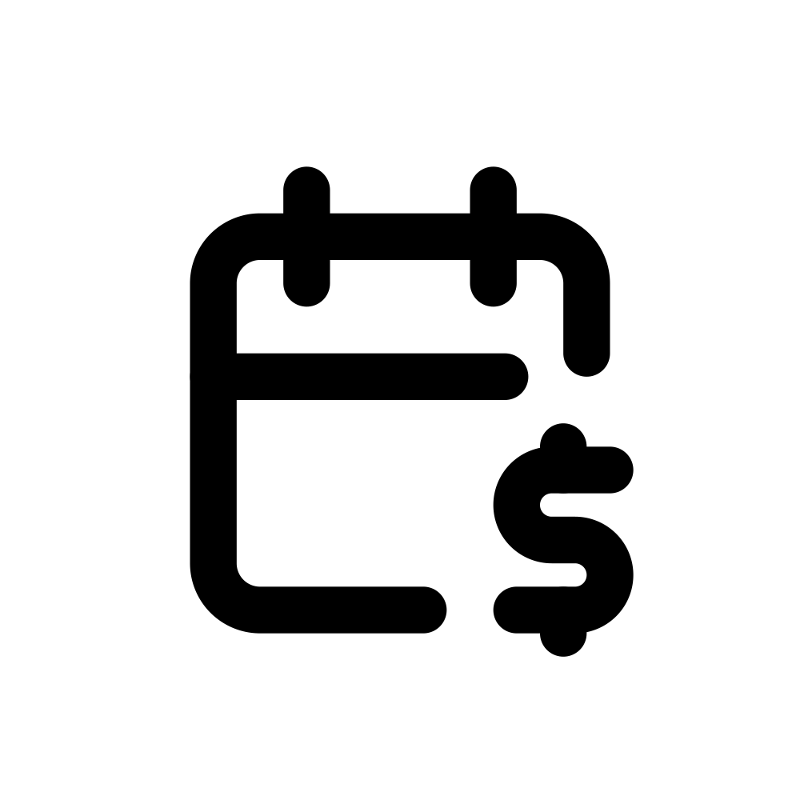
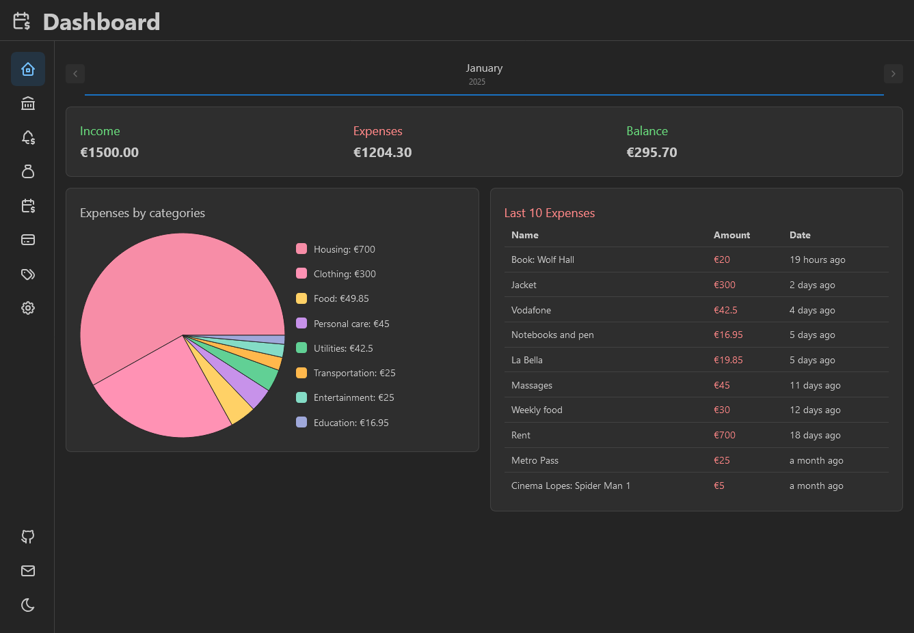

# Balance 

A simple personal finance app to help you manage your finances.



## Features
- A dashboard with a detailed resume of all your expenses and Income, defined for each Month
- Accounts Management with the option of handling more than one account per user
- Several resources such as Income and Expenses Tabs amongst others to better keep track of all your spending, with the choice to attach it to a specific account
- A Budget Area that allows the user to keep track of any personalized goals for any specific spending track of your choice
- Personalization for all kinds of Categories, that helps you separate each expense on what your spending are being used for
- Customizable Categories for each and any of your needs
- Search for all types of values using the available Filters. This helps you find a specific selection of transitions by your definition with ease, including by Name, Date of Action, Type of Expense and more
- Prepared to save your whole Account tracking information into a local .db file, so you can import and export it and use anywhere you want, with or without a password for your security.
- UI Compatible for both PC and Mobile users
- Multiple Currency Compatible
- Available both in Portuguese and English
- Entirely runned locally! No Information or accounts required from the user to start using the App

## Future Implementations
- [ ] **Welcome Tour:**
- [ ] **Account ID Page:**
- [ ] **Iterative Dashboard:** Allow to the user to select with card he can see and the order
- [ ] **Improved Import Functionality:**
- [ ] **Custom Export Options:** Select with tables the user wants to export
- [ ] **Investment Page:**
- [ ] **Tables Pagination:**
- [ ] **Alert Debts:** Allow to the user to set future debts and get an custom alert
- [ ] **Past Debts:** Allow to the user to save past debts
- [ ] **Account currency:**
- [ ] **Export PDF report:**

## How to install
```
git clone https://github.com/jcggraca/balance.git
```
```
npm install
```
```
npm run dev
```

## Contact
Have questions or feedback? Feel free to reach out:
- GitHub Issues: [Report an Issue](https://github.com/jcggraca/balance/issues)
- Email: jcggraca@proton.me

## License
This project is licensed under the [MIT License](LICENSE).

Made by [João](https://www.linkedin.com/in/jcggraca/) :wave:
